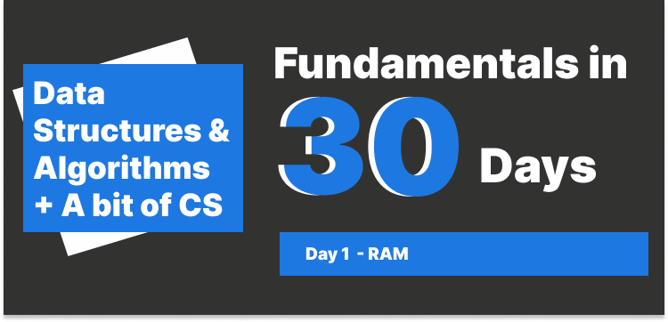
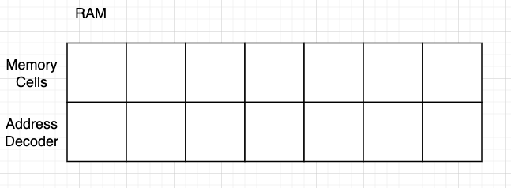
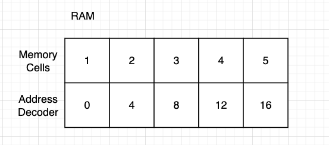

# Day 1 : RAM

## Table of Contents

- [What is RAM](#what-is-ram)
- [Basic units of storage](#basic-units-of-storage)
- [Components of RAM](#components-of-ram)
- [Array](#array)
- [The unit of RAM](#the-unit-of-ram)
- [Array of Strings](#array-of-strings)

---

### What is RAM

Ram also known as **Random Access Memory**. It is a type of computer memory that can be accessed randomly. In other words, any byte of memory can be accessed without touching the preceding bytes. Ram is the most common type of memory found in computers and other devices, such as printers.

### Basic units of storage

The basic unit of storage in computer data storage is called a `bit` (short for `binary digit`). A bit has a single binary value, either `0` or `1`.

In most computer systems, a `byte` is a unit of data that is eight binary digits long. Bytes are often used to represent a character such as a letter, number, or typographic symbol.

### Components of RAM

1. **Memory Cells**: Each cell is made up of one bit of data storage.
2. **Address Decoder**: The address decoder is used to select the memory cell to be read or written.

### Array

An array is a data structure that contains a group of elements, let's say we have an array of `[1, 2, 3, 4, 5]`, when it stores in the RAM, it looks like this:

See the address of each element in the array, why thr sequence increases by 4 in the address?

### The unit of RAM

The unit of RAM is `byte`, the data is stored in the form of bytes in the RAM.

1 byte = 8 bits, a bit (as known as **Binary digit**) is the smallest unit of memory, we can think of it is a position in the memory cell.

Let's circle back to the array example, the array `[1, 2, 3, 4, 5]`, each value takes 4 bytes (32 bits) in the memory cell, therefore it increases by 4 in the address.

> ❗❗ The address of the value is not continuous, but the value are continuous.

What about the array of strings? How does it store in the memory cell?

### Array of Strings

An array of strings is a collection of strings stored in the memory cell. Let's say we have an array of `["apple", "banana", "cherry"]`, in ASCII, one character takes **1 byte**, therefore "apple" means 5 bytes, "banana" means 6 bytes, and "cherry" means 6 bytes, even though the address of each element is not continuous, but the address of the value is determined by the number of bytes it takes.

---

### Big words

- Bit
  - Binary digit.
  - 2 number system (0, 1).
  - All data is stored in the form of bits.
  - e.g. 110, this is a 3-bit number.
- Byte
  - 1 byte = 11001100 (8 bits).
- RAM
  - Full form: Random Access Memory.
  - Temporary memory.
  - RAM is volatile memory, it loses data when the power is turned off.
- ASCII

### Resources

- NeetCode
