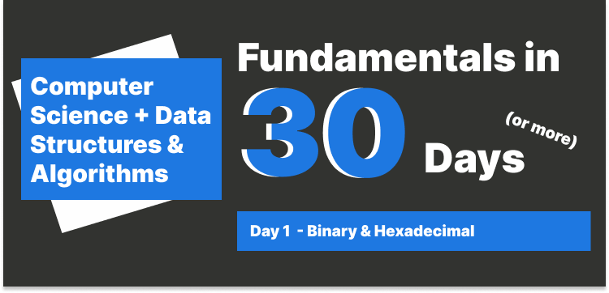

# Day 1 Binary and Hexadecimal



## Table of Contents

- [What is Binary?](#what-is-binary)
- [From code to binary](#from-code-to-binary)
  - [Compiler](#compiler)
  - [Interpreter](#interpreter)
- [Bit and Byte](#bit-and-byte)
- [Denary to Binary conversion](#denary-to-binary-conversion)
- [Binary to Denary conversion](#binary-to-denary-conversion)
- [Hexadecimal](#hexadecimal)

---

### What is Binary?

Before jumping into the topic, first thing first, everything we see on the computer is composed of 0s and 1s."bi" means two, there're vocabularies like bicycle, bisexuality, etc. There are two stats in computer's world, which is on and off, we can think of on as 1 and off as 0, this also refers to boolean logic, which is true and false, 1 is true and 0 is false.

The smallest unit of data in a computer is called a **bit** - which is short for binary digit. A bit has a single binary value, either 0 or 1.

---

### From source code to binary

The code we write is not looked like binary, but how does the computer understand the code?

There's a process called **compilation** or **Interpretation**, which is the process of translating the code we write into binary, so the computer can understand it.

When we talk about how to execute the code, we often categorize the programming languages into two types, **compiled languages** and **interpreted languages**.

#### Compiler:

A compiler is a program that translates code written in a high-level programming languages like C, C++, etc, it converts the source code into intermediate code (low-level programming language like assembly code) and then into machine code (binary code).

Below demonstrates the process of compilation:

```plaintext
High-level code (source code) --> Preprocessor -> Compiler -> Assembler -> Object code -> Linker -> Executable code
```

#### Interpreter:

s
A interpreter is a program that directly executes instructions in a programming or scripting language (JavaScript, Python, etc.) without previously to compile into the machine code.

Just to remember that a compiler needs to compile everything before running the code, but an interpreter can run the code line by line.

---

### Bit and Byte

I bet you have heard of the term **byte**, a byte is a unit that consists of 8 bits.

In JavaScript, number uses IEEE 754 standard, which is 64 bits, 8 bytes, for example:

```javascript
let num = 10; // 64 bits (8 bytes)
```

When it comes to string, it uses UTF-16 encoding, which is 16 bits, 2 bytes, for example:

```javascript
let cha = "A"; // 16 bits (2 bytes)
let str = "Hello"; // 80 bits (10 bytes) (5 characters * 16 bits)
```

How about an emoji or some rare characters? It uses UTF-32 encoding, which is 32 bits, 4 bytes, for example:

```javascript
let emoji = "😂"; // 32 bits (4 bytes)
```

### Denary to Binary conversion

Divide by 2 is the method I found the easiest to convert denary to binary.

The steps are as follows:

1. Divide the number by 2.
2. Write down the remainder.
3. Write down the quotient.
4. Repeat the process until the quotient is 0.
5. Read the remainders from bottom to top.

Let's take an example, convert 13 to binary:

```plaintext
13 / 2 = 6 remainder 1
6 / 2 = 3 remainder 0
3 / 2 = 1 remainder 1
1 / 2 = 0 remainder 1
```

Read from bottom to top, we get 1101, which is 13 in binary.

Another example, convert 23 to binary:

```plaintext
23 / 2 = 11 remainder 1
11 / 2 = 5 remainder 1
5 / 2 = 2 remainder 1
2 / 2 = 1 remainder 0
1 / 2 = 0 remainder 1
```

Read from bottom to top, we get 10111, which is 23 in binary.

### Binary to Denary conversion

Let's say we want to convert 1010111 to denary:

Here is the position of each bit:

```plaintext

  1 0 1 0 1 1 1
  | | | | | | |
  6 5 4 3 2 1 0
```

The formula to convert binary to denary is:

```plaintext
denary = (bit * 2^position) + (bit * 2^position) + ... + (bit * 2^position)
```

Let's calculate the above example:

```plaintext
1 * 2^0 = 1
1 * 2^1 = 2
1 * 2^2 = 4
0 * 2^3 = 0
1 * 2^4 = 16
0 * 2^5 = 0
1 * 2^6 = 64
```

The left side is the bit, and the right side is the position, and we add the results together, we get 87.

---

### Hexadecimal

Hexadecimal also called base-16 or hex, it is a numeral system the uses 16 symbols, 0-9 and A-F, which represents 10-15.

It's common to use hexadecimal in web development, `HTML` and `CSS` are using hexadecimal to represent colors, for example, `#000000` represents black, `#FFFFFF` represents white.

Also URL encoding uses hexadecimal, for example, `%20` represents a space, in modern browsers, hexadecimal will be decoded into actual characters.
