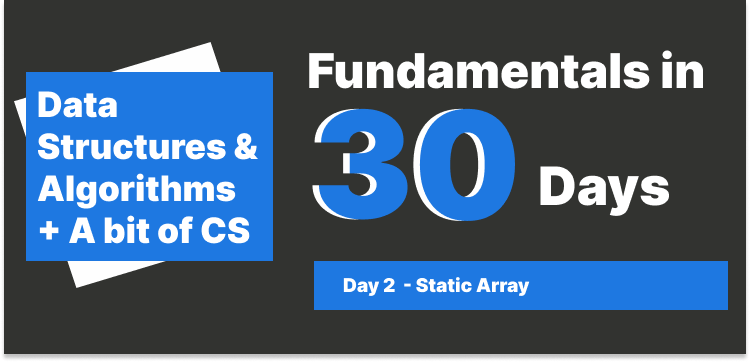

# Static Array



## Table of Contents

- [Review Day 1](#review-day-1)
- [Limitation of a Static Array](#limitation-of-a-static-array)
- [Logic Deletion](#logic-deletion)
  - [Definition of Logic Deletion](#definition-of-logic-deletion)
- [Inserting / removing a value in a Static Array](#inserting--removing-a-value-in-a-static-array)
  - [Scenarios 1: Insert / remove the value at the **end** of the array.](#scenarios-1-insert--remove-the-value-at-the-end-of-the-array)
  - [Scenarios 2: Insert / remove value at beginning of the array.](#scenarios-2-insert--remove-value-at-beginning-of-the-array)
  - [Scenarios 3: Insert / remove value at the middle of the array.](#scenarios-3-insert--remove-value-at-the-middle-of-the-array)
- [Would removing an element affect the RAM?](#would-removing-an-element-affect-the-ram)
- [Conclusion](#conclusion)

---

### Review Day 1

We have talked about `array` in day 1, we know that `array` is a continuos block of data. We can access the data using `index`, and we talked about what is `dynamic array` and `static array` and their differences and time complexity.

In short:

- `Dynamic Array` is a resizable array, it can grow and shrink, programming languages like JavaScript or python have dynamic arrays.
- `Static Array` is a fixed-size array, it can't grow or shrink, programming languages like C or C++ have static arrays.

---

### Limitation of a Static Array

We already know that when we declare an array, it will be stored in RAM, but the address of the array is completely random, and this is not something we can control, this means, when we try to write a new value to the array, the new value will be stored somewhere in the RAM.

It cannot be expended continuously, and it is not resizable.

---

### Logic Deletion

Since static array is fixed-size, the action of deleting an element is **NOT** actually deleting it, but rather just marking it as deleted, this is called `Logic Deletion`.

#### Definition of Logic Deletion

The element is marked as deleted without changing the physical structure of the array.

In the contrast, `physical deletion` is actually removed element from the array and subsequently shifting all the elements to the left.

```js
// Logic Deletion
const arr = [1, 2, 3, 4, 5];
arr[2] = null; // or undefined or -1
```

---

### Inserting / removing a value in a Static Array

Here we need to discuss scenarios:

#### Scenarios 1: Insert / remove the value at the **end** of the array.

Above scenario is relatively easy, and the time complexity is `O(1)`, which is in **constant time**.

#### Scenarios 2: Insert / remove value at beginning of the array.

In this scenario, we need to shift the elements to the right, let'say we have `[3, 4]`, and we want to add 2 at the beginning, the steps will be:

- Shift `3` to the right (from index 0 to index 1).
- Shift `4` to the right (from index 1 to index 2).
- Add `2` at the beginning.

#### Scenarios 3: Insert / remove value at the middle of the array.

In this scenario, we need to shift the elements to the right, let'say we have `[1, 3]`, and we want to add 2 at index 1, the steps will be:

- Shift `3` to the right (from index 1 to index 2).
- Add `2` at index 1.

Even the last scenario might be less complex, but when we talk about time complexity, we are talking about the **worst-case scenario**, no matter how many elements need to be shifted, therefore, with scenarios 2 and 3, the time complexity is `O(n)`, which is in **linear time**, the `n` represents the number of elements in the array.

### Would removing an element affect the RAM?

No, removing an element from the array will not affect the RAM, the element will be marked as deleted, and the RAM will not be affected.

### Conclusion

- Static array is a fixed-size array.
- when we say removing an element from a static array, we are actually marking it as deleted, which is called `Logic Deletion`.
- Accessing or modifying an element at a specific index in an array is done in constant time (`O(1)`) since arrays allow direct access to any element.
- Inserting or removing an element at the end of an array is done in constant time (`O(1)`).
- Inserting or removing an element at the beginning or middle of an array is done in linear time (`O(n)`), since we need to shift all the elements to the right or left.
